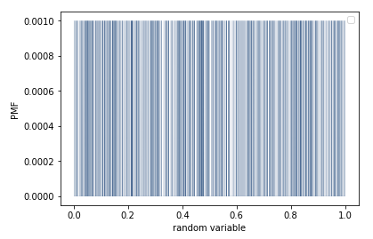
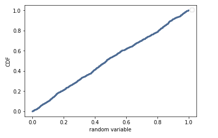

[Think Stats Chapter 4 Exercise 2](http://greenteapress.com/thinkstats2/html/thinkstats2005.html#toc41) (a random distribution)

>> 
Codeblock

```python

from __future__ import print_function, division

%matplotlib inline

import numpy as np

import nsfg
import thinkstats2
import thinkplot


rand = np.random.random(1000)

pmf = thinkstats2.Pmf(rand)
thinkplot.Pmf(pmf, linewidth=0.1)
thinkplot.Config(xlabel='random variable', ylabel='PMF')

cdf = thinkstats2.Cdf(rand)
thinkplot.Cdf(cdf)
thinkplot.Config(xlabel='random variable', ylabel='CDF')

```








The PMF returns the same value (.001) for each random variable, this makes sense because each number has the same probability of occuring (1/1000)


The CDF returns a straight line, which means the distribution is uniform.  


